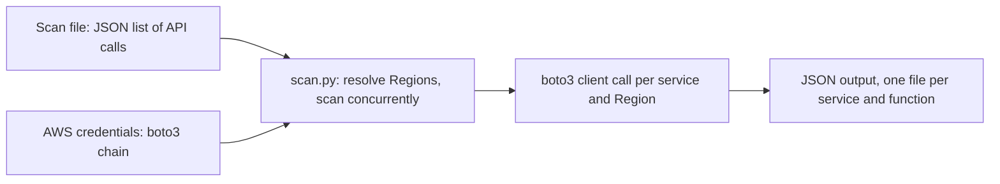

# AWS Auto Inventory

A command-line tool that scans AWS services across regions and accounts and writes the results to JSON files.

## Overview

AWS Auto Inventory builds a resource inventory by calling AWS API operations that you define in a scan file, then saving each response as JSON. You control which services, API functions, parameters, and regions are scanned. The tool runs regions and services concurrently and retries throttled or transient API calls with exponential backoff.

You use AWS Auto Inventory to collect a point-in-time snapshot of resources for auditing, reporting, or migration planning. It reads your AWS credentials through the standard boto3 credential chain, so it works the same way the AWS Command Line Interface (AWS CLI) does.

The repository contains two entry points:

- **`scan.py`** — the supported command-line scanner. It reads a JSON scan file (a list of API calls), writes JSON output, and can scan every account in an AWS Organization. This is the tool described in this README.
- **`aws_auto_inventory` package** (the `aws-auto-inventory` console script) — an in-progress rewrite that adds YAML configuration, a Pydantic-validated `inventories`/`sheets` schema, and Excel output. The output module is not yet present in the package, so this console script does not produce output today. Use `scan.py` for working scans. See [Architecture](aws-auto-inventory-unified-architecture.md) for the design of the rewrite.

## Features

- Scans any boto3 service and API function you list in a scan file.
- Scans multiple AWS Regions concurrently. If you do not pass regions, it scans every Region your account can reach.
- Extracts a specific part of each API response by key name or by `jq` filter.
- Retries throttled and transient API errors with exponential backoff.
- Scans every active account in an AWS Organization by assuming a role in each account.
- Writes one JSON file per service and function, organized by Region and a run timestamp.

## Prerequisites

- Python 3.8 or later.
- AWS credentials available through the standard credential chain (environment variables, a shared credentials file, or an Amazon EC2 instance profile).
- AWS Identity and Access Management (IAM) permissions for the API operations you scan, plus `sts:GetCallerIdentity`. Organization scans also require `organizations:ListAccounts` on the management account and `sts:AssumeRole` for the role you assume in each member account.
- The `boto3`, `requests`, and `jq` Python packages. `scan.py` imports all three. The `jq` package needs the `jq` C library and a compiler available at install time.

## Installation

Clone the repository and install the dependencies that `scan.py` requires.

```bash
git clone https://github.com/aws-samples/aws-auto-inventory.git
cd aws-auto-inventory
pip install boto3 requests jq
```

> **Note:** `requirements.txt` and `setup.py` target the in-progress `aws_auto_inventory` package, not `scan.py`. `scan.py` also imports `requests`, which is not listed there. Install `boto3`, `requests`, and `jq` as shown to run `scan.py`.

## Getting started

This example scans your Amazon Simple Storage Service (Amazon S3) buckets in one Region.

1. Create a scan file named `s3.json` that lists the API call to make.

   ```json
   [
     {
       "service": "s3",
       "function": "list_buckets",
       "result_key": "Buckets"
     }
   ]
   ```

2. Run the scan against `us-east-1`.

   ```bash
   python scan.py --scan s3.json --regions us-east-1 --output_dir output
   ```

3. The tool prints the identity it authenticated as, the elapsed time, and where it stored the results.

   ```text
   Authenticated as: arn:aws:iam::123456789012:user/example
   Total elapsed time for scanning: 0h:0m:3s
   Result stored in  output/2026-06-07T12-30
   ```

4. Find the JSON output under the timestamped Region directory.

   ```text
   output/2026-06-07T12-30/us-east-1/s3-list_buckets.json
   ```

A log file for each run is written to the output directory as `aws_resources_<timestamp>.log`.

## Usage

Run `scan.py` with a scan file and, optionally, a list of Regions.

```bash
python scan.py --scan examples/scan.json --regions us-east-1 us-west-2 --output_dir output
```

Sample scan files are provided under `scan/sample/`. `scan/sample/all_services.json` lists every readable API function across all services. Per-service files are under `scan/sample/services/`.

### Command-line options

| Flag | Description | Default |
| --- | --- | --- |
| `-s`, `--scan` | Path or URL to the JSON scan file. Required. | — |
| `-r`, `--regions` | Space-separated list of Regions to scan. | All reachable Regions |
| `-o`, `--output_dir` | Directory for results and logs. | `output` |
| `-l`, `--log_level` | Logging level: `DEBUG`, `INFO`, `WARNING`, `ERROR`, or `CRITICAL`. | `INFO` |
| `--max-retries` | Maximum retries per API call. | `3` |
| `--retry-delay` | Base delay in seconds for retry backoff. | `2` |
| `--concurrent-regions` | Number of Regions to scan at once. | All at once |
| `--concurrent-services` | Number of services to scan at once per Region. | All at once |
| `--organization-scan` | Scan every active account in the AWS Organization. | Off |
| `--org-role-name` | IAM role to assume in each member account. | `OrganizationAccountAccessRole` |

### Scan an AWS Organization

To scan every active account in your AWS Organization, run the scanner from the management account with `--organization-scan`. The tool lists all active accounts with `organizations:ListAccounts`, assumes the named role in each account, and runs the scan there.

```bash
python scan.py --scan examples/scan.json --organization-scan --org-role-name OrganizationAccountAccessRole
```

The organization scan lists accounts directly; it does not traverse organizational units (OUs). Results for each account are written under `output/organization-<timestamp>/<account-id>/`, with an `accounts.json` summary at the top level.

### Load a scan file from a URL

You can pass a URL instead of a local path. The tool fetches the JSON over HTTP or HTTPS.

```bash
python scan.py --scan https://example.com/scans/core.json --regions us-east-1
```

## Configuration

A scan file is a JSON array. Each element describes one API call.

| Field | Required | Description |
| --- | --- | --- |
| `service` | Yes | The boto3 service name, such as `ec2` or `s3`. |
| `function` | Yes | The boto3 client method to call, such as `describe_instances`. |
| `result_key` | No | Extracts part of the response. A plain key (such as `Reservations`) reads that top-level field. A value that starts with `.` is evaluated as a `jq` filter against the full response. If omitted, the full response is returned with `ResponseMetadata` removed. |
| `parameters` | No | A map of keyword arguments passed to the API call. |

The following scan file lists running Amazon Elastic Compute Cloud (Amazon EC2) instances and all S3 buckets.

```json
[
  {
    "service": "ec2",
    "function": "describe_instances",
    "result_key": "Reservations",
    "parameters": {
      "Filters": [
        {
          "Name": "instance-state-name",
          "Values": ["running"]
        }
      ]
    }
  },
  {
    "service": "s3",
    "function": "list_buckets",
    "result_key": "Buckets"
  }
]
```

### Generate a scan file for every service

`scan_builder.py` writes a scan file for every available service into `scan/sample/services/`, listing each `get`, `describe`, and `list` function. Run it with AWS credentials configured.

```bash
python scan_builder.py
```

## Credentials

AWS Auto Inventory uses the standard boto3 credential chain, in this order:

1. Environment variables.
2. The shared credentials file (`~/.aws/credentials`).
3. An IAM role attached to an Amazon EC2 instance or container.

Before scanning, the tool calls `sts:GetCallerIdentity` and prints the authenticated principal. If the call fails, the scan stops.

## Output

For a single-account scan, the tool writes one JSON file per service and function:

```text
output/<timestamp>/<region>/<service>-<function>.json
```

`datetime` values in API responses are serialized as ISO 8601 strings. Binary values returned by some API operations (for example, `cloudtrail:ListPublicKeys`) are not specially encoded and can cause a serialization error on the affected service. This affects scans that include such operations, including some scans in AWS GovCloud (US).

## Architecture

The following diagram shows the `scan.py` flow: a scan file and your credentials drive concurrent per-Region, per-service boto3 calls, and each result is written to its own JSON file.



For the design of the in-progress `aws_auto_inventory` package rewrite — configuration layer, scan engine, and output processor — see [Architecture](aws-auto-inventory-unified-architecture.md).

## Contributing

See [Contributing](CONTRIBUTING.md) for how to propose changes.

## Security

See [Security](SECURITY.md) for how to report a vulnerability.

## License

This project is licensed under the Apache License 2.0. See [LICENSE](LICENSE) for details.
