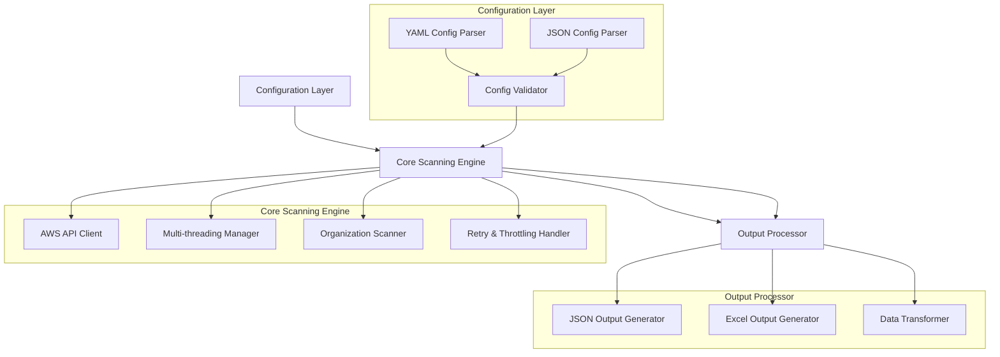
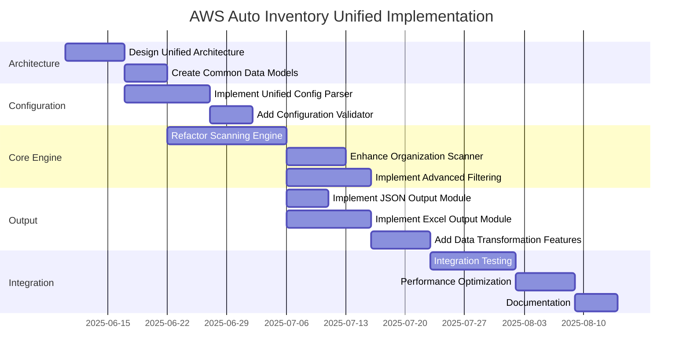
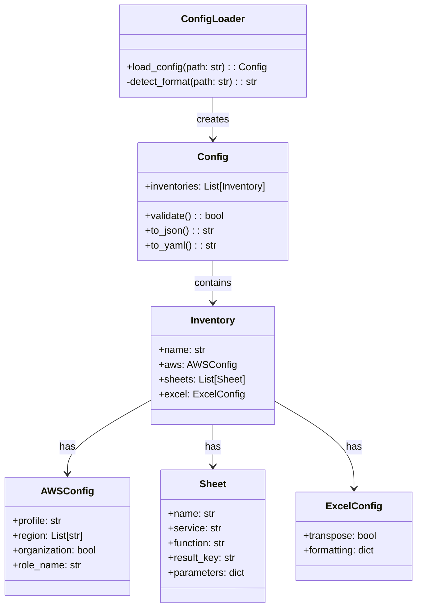
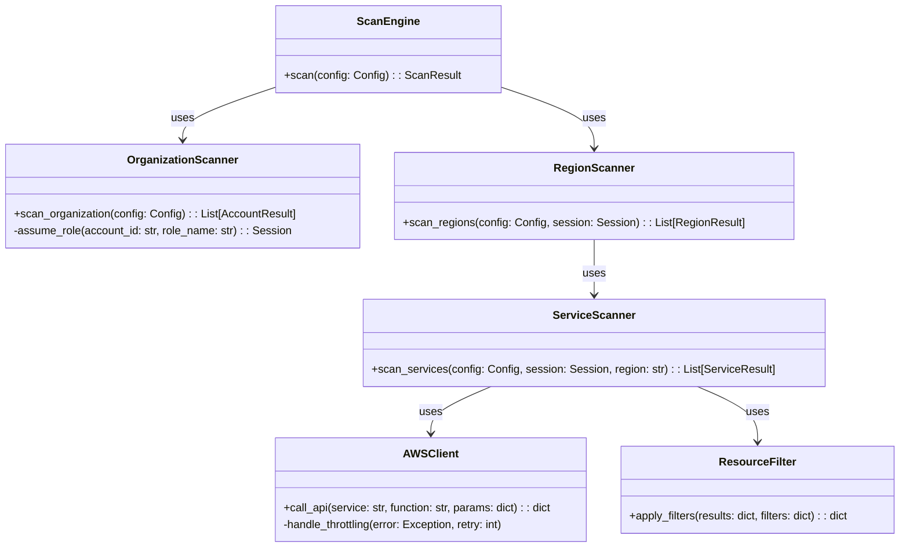
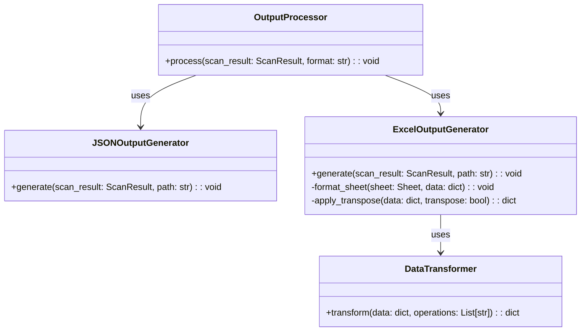

# AWS Auto Inventory: Unified Architecture Plan

## Table of Contents
1. [Current State Analysis](#current-state-analysis)
2. [Unified Architecture Design](#unified-architecture-design)
3. [Detailed Implementation Strategy](#detailed-implementation-strategy)
4. [Implementation Details](#implementation-details)
5. [Potential Challenges and Mitigation Strategies](#potential-challenges-and-mitigation-strategies)
6. [Next Steps](#next-steps)

## Current State Analysis

### JSON-based Implementation (Current Codebase)
- **Strengths**: 
  - Multi-threading for concurrent scanning of regions and services
  - Organization-wide scanning across multiple AWS accounts
  - Robust API call retry logic and throttling handling
  - Simple JSON configuration format
  - Direct AWS API access through boto3
  - Modular design with separate components for scanning and organization handling

### Excel-based Implementation (Described in habits.yaml)
- **Strengths**:
  - Excel spreadsheet output (more user-friendly for analysis)
  - YAML configuration format (more human-readable)
  - Advanced filtering capabilities (by tags, VPC, subnets, etc.)
  - Support for multiple AWS accounts through profiles
  - Transposable data in Excel output

## Unified Architecture Design

### Architecture Overview



### Component Details

#### 1. Configuration Layer
- **Unified Configuration Format**: Support both YAML and JSON configuration formats
- **Configuration Validator**: Ensure configurations are valid regardless of format
- **Configuration Converter**: Allow conversion between formats
- **Feature Parity**: Ensure all filtering and selection options are available in both formats

#### 2. Core Scanning Engine
- **AWS API Client**: Maintain the robust boto3 integration from the JSON implementation
- **Multi-threading Manager**: Keep the concurrent scanning capabilities
- **Organization Scanner**: Preserve the ability to scan across multiple accounts
- **Retry & Throttling Handler**: Maintain the robust error handling and retry logic
- **Resource Filter**: Implement the filtering capabilities from the Excel implementation

#### 3. Output Processor
- **Data Model**: Create a unified data model that can be serialized to both JSON and Excel
- **JSON Output Generator**: Maintain the current JSON output functionality
- **Excel Output Generator**: Add the Excel output capabilities
- **Data Transformer**: Support operations like transposition for Excel output

### Implementation Plan



## Detailed Implementation Strategy

### 1. Refactor the Configuration System

Create a unified configuration system that supports both YAML and JSON formats:



### 2. Enhance the Core Scanning Engine

Refactor the scanning engine to maintain the multi-threading and organization scanning capabilities while adding the filtering features:



### 3. Implement the Output Processor

Create a flexible output system that can generate both JSON and Excel outputs:



## Implementation Details

### Project Structure

```
aws-auto-inventory/
├── aws_auto_inventory/
│   ├── __init__.py
│   ├── cli.py                  # Command-line interface
│   ├── config/
│   │   ├── __init__.py
│   │   ├── loader.py           # Config loading (YAML/JSON)
│   │   ├── validator.py        # Config validation
│   │   └── models.py           # Config data models
│   ├── core/
│   │   ├── __init__.py
│   │   ├── aws_client.py       # AWS API client with retry logic
│   │   ├── scan_engine.py      # Main scanning engine
│   │   ├── organization.py     # Organization scanning
│   │   ├── region.py           # Region scanning
│   │   ├── service.py          # Service scanning
│   │   └── filter.py           # Resource filtering
│   ├── output/
│   │   ├── __init__.py
│   │   ├── processor.py        # Output processing
│   │   ├── json_generator.py   # JSON output
│   │   ├── excel_generator.py  # Excel output
│   │   └── transformer.py      # Data transformation
│   └── utils/
│       ├── __init__.py
│       ├── logging.py          # Logging utilities
│       └── threading.py        # Threading utilities
├── tests/
│   ├── __init__.py
│   ├── conftest.py
│   ├── test_config/
│   ├── test_core/
│   └── test_output/
├── examples/
│   ├── config_yaml_example.yaml
│   ├── config_json_example.json
│   └── README.md
├── setup.py
├── requirements.txt
└── README.md
```

### Key Implementation Components

#### 1. Configuration System

The configuration system will support both YAML and JSON formats with automatic detection:

```python
# aws_auto_inventory/config/loader.py
import yaml
import json
import os
from .models import Config

class ConfigLoader:
    def load_config(self, path):
        """Load configuration from file."""
        format_type = self._detect_format(path)
        
        with open(path, 'r') as f:
            if format_type == 'yaml':
                config_data = yaml.safe_load(f)
            else:  # json
                config_data = json.load(f)
        
        return Config.from_dict(config_data)
    
    def _detect_format(self, path):
        """Detect file format based on extension."""
        _, ext = os.path.splitext(path)
        if ext.lower() in ['.yaml', '.yml']:
            return 'yaml'
        return 'json'
```

Configuration data models will use Pydantic for validation:

```python
# aws_auto_inventory/config/models.py
from pydantic import BaseModel, Field
from typing import List, Dict, Optional, Union, Any

class ExcelConfig(BaseModel):
    transpose: bool = False
    formatting: Dict[str, Any] = Field(default_factory=dict)

class AWSConfig(BaseModel):
    profile: Optional[str] = None
    region: List[str] = Field(default_factory=lambda: ["us-east-1"])
    organization: bool = False
    role_name: str = "OrganizationAccountAccessRole"

class Sheet(BaseModel):
    name: str
    service: str
    function: str
    result_key: Optional[str] = None
    parameters: Dict[str, Any] = Field(default_factory=dict)

class Inventory(BaseModel):
    name: str
    aws: AWSConfig = Field(default_factory=AWSConfig)
    sheets: List[Sheet]
    excel: ExcelConfig = Field(default_factory=ExcelConfig)

class Config(BaseModel):
    inventories: List[Inventory]
    
    def to_json(self):
        """Convert config to JSON string."""
        return self.json(indent=2)
    
    def to_yaml(self):
        """Convert config to YAML string."""
        import yaml
        return yaml.dump(self.dict(), sort_keys=False)
    
    @classmethod
    def from_dict(cls, data):
        """Create config from dictionary."""
        return cls(**data)
```

#### 2. Core Scanning Engine

The core scanning engine will maintain the multi-threading and organization scanning capabilities:

```python
# aws_auto_inventory/core/scan_engine.py
import concurrent.futures
from ..config.models import Config, Inventory
from .organization import OrganizationScanner
from .region import RegionScanner

class ScanEngine:
    def __init__(self, max_workers_regions=None, max_workers_services=None):
        self.max_workers_regions = max_workers_regions
        self.max_workers_services = max_workers_services
        self.organization_scanner = OrganizationScanner()
        self.region_scanner = RegionScanner(max_workers=max_workers_services)
    
    def scan(self, config):
        """Perform scanning based on configuration."""
        results = []
        
        for inventory in config.inventories:
            if inventory.aws.organization:
                # Scan across organization
                org_results = self.organization_scanner.scan_organization(
                    inventory, self.region_scanner
                )
                results.append({
                    "inventory_name": inventory.name,
                    "organization_results": org_results
                })
            else:
                # Scan single account
                import boto3
                session = boto3.Session(profile_name=inventory.aws.profile)
                
                # Scan regions concurrently
                with concurrent.futures.ThreadPoolExecutor(
                    max_workers=self.max_workers_regions
                ) as executor:
                    future_to_region = {
                        executor.submit(
                            self.region_scanner.scan_region,
                            inventory, session, region
                        ): region
                        for region in inventory.aws.region
                    }
                    
                    region_results = []
                    for future in concurrent.futures.as_completed(future_to_region):
                        region = future_to_region[future]
                        try:
                            result = future.result()
                            region_results.append({
                                "region": region,
                                "services": result
                            })
                        except Exception as e:
                            print(f"Error scanning region {region}: {e}")
                
                results.append({
                    "inventory_name": inventory.name,
                    "account_results": region_results
                })
        
        return results
```

AWS API client with retry logic:

```python
# aws_auto_inventory/core/aws_client.py
import time
import boto3
import botocore

class AWSClient:
    def __init__(self, session, max_retries=3, retry_delay=2):
        self.session = session
        self.max_retries = max_retries
        self.retry_delay = retry_delay
    
    def call_api(self, service, function_name, region=None, parameters=None):
        """Call AWS API with retry logic."""
        client = self.session.client(service, region_name=region)
        
        for attempt in range(self.max_retries):
            try:
                function_to_call = getattr(client, function_name)
                if parameters:
                    return function_to_call(**parameters)
                else:
                    return function_to_call()
            except botocore.exceptions.ClientError as error:
                error_code = error.response["Error"]["Code"]
                if error_code in ["Throttling", "RequestLimitExceeded"]:
                    if attempt < (self.max_retries - 1):
                        wait_time = self.retry_delay ** attempt
                        time.sleep(wait_time)
                        continue
                raise
            except botocore.exceptions.BotoCoreError:
                if attempt < (self.max_retries - 1):
                    wait_time = self.retry_delay ** attempt
                    time.sleep(wait_time)
                    continue
                raise
        
        return None
```

#### 3. Output Processor

The output processor will support both JSON and Excel formats:

```python
# aws_auto_inventory/output/processor.py
from .json_generator import JSONOutputGenerator
from .excel_generator import ExcelOutputGenerator

class OutputProcessor:
    def __init__(self):
        self.json_generator = JSONOutputGenerator()
        self.excel_generator = ExcelOutputGenerator()
    
    def process(self, scan_result, output_dir, formats=None):
        """Process scan results and generate output files."""
        if formats is None:
            formats = ["json"]  # Default to JSON
        
        if "json" in formats:
            self.json_generator.generate(scan_result, output_dir)
        
        if "excel" in formats:
            self.excel_generator.generate(scan_result, output_dir)
```

Excel output generator:

```python
# aws_auto_inventory/output/excel_generator.py
import os
import pandas as pd
from .transformer import DataTransformer

class ExcelOutputGenerator:
    def __init__(self):
        self.transformer = DataTransformer()
    
    def generate(self, scan_result, output_dir):
        """Generate Excel output from scan results."""
        os.makedirs(output_dir, exist_ok=True)
        
        for inventory_result in scan_result:
            inventory_name = inventory_result["inventory_name"]
            excel_path = os.path.join(output_dir, f"{inventory_name}.xlsx")
            
            with pd.ExcelWriter(excel_path) as writer:
                if "organization_results" in inventory_result:
                    self._process_organization_results(
                        inventory_result["organization_results"], writer
                    )
                elif "account_results" in inventory_result:
                    self._process_account_results(
                        inventory_result["account_results"], writer
                    )
    
    def _process_organization_results(self, org_results, writer):
        """Process organization results and write to Excel."""
        for account_result in org_results:
            account_id = account_result["account_id"]
            for region_result in account_result["regions"]:
                region = region_result["region"]
                for service_result in region_result["services"]:
                    sheet_name = f"{account_id}_{region}_{service_result['service']}"
                    # Truncate sheet name if too long (Excel limitation)
                    if len(sheet_name) > 31:
                        sheet_name = sheet_name[:31]
                    
                    df = pd.json_normalize(service_result["result"])
                    df.to_excel(writer, sheet_name=sheet_name)
    
    def _process_account_results(self, account_results, writer):
        """Process account results and write to Excel."""
        for region_result in account_results:
            region = region_result["region"]
            for service_result in region_result["services"]:
                sheet_name = f"{region}_{service_result['service']}"
                # Truncate sheet name if too long (Excel limitation)
                if len(sheet_name) > 31:
                    sheet_name = sheet_name[:31]
                
                df = pd.json_normalize(service_result["result"])
                df.to_excel(writer, sheet_name=sheet_name)
```

#### 4. Command-Line Interface

The CLI will provide a unified interface for all features:

```python
# aws_auto_inventory/cli.py
import argparse
import os
import sys
from .config.loader import ConfigLoader
from .core.scan_engine import ScanEngine
from .output.processor import OutputProcessor

def main():
    parser = argparse.ArgumentParser(
        description="AWS Auto Inventory - Scan AWS resources and generate inventory"
    )
    parser.add_argument(
        "-c", "--config", required=True,
        help="Path to configuration file (YAML or JSON)"
    )
    parser.add_argument(
        "-o", "--output-dir", default="output",
        help="Directory to store output files"
    )
    parser.add_argument(
        "-f", "--format", choices=["json", "excel", "both"], default="json",
        help="Output format (default: json)"
    )
    parser.add_argument(
        "--max-regions", type=int, default=None,
        help="Maximum number of regions to scan concurrently"
    )
    parser.add_argument(
        "--max-services", type=int, default=None,
        help="Maximum number of services to scan concurrently per region"
    )
    parser.add_argument(
        "--log-level", choices=["DEBUG", "INFO", "WARNING", "ERROR"], default="INFO",
        help="Logging level"
    )
    
    args = parser.parse_args()
    
    # Set up logging
    import logging
    logging.basicConfig(
        level=getattr(logging, args.log_level),
        format="%(asctime)s - %(name)s - %(levelname)s - %(message)s"
    )
    
    # Load configuration
    config_loader = ConfigLoader()
    try:
        config = config_loader.load_config(args.config)
    except Exception as e:
        print(f"Error loading configuration: {e}")
        sys.exit(1)
    
    # Create output directory
    os.makedirs(args.output_dir, exist_ok=True)
    
    # Determine output formats
    formats = []
    if args.format in ["json", "both"]:
        formats.append("json")
    if args.format in ["excel", "both"]:
        formats.append("excel")
    
    # Run scan
    scan_engine = ScanEngine(
        max_workers_regions=args.max_regions,
        max_workers_services=args.max_services
    )
    
    try:
        results = scan_engine.scan(config)
    except Exception as e:
        print(f"Error during scan: {e}")
        sys.exit(1)
    
    # Process output
    output_processor = OutputProcessor()
    output_processor.process(results, args.output_dir, formats)
    
    print(f"Inventory completed successfully. Results stored in {args.output_dir}")

if __name__ == "__main__":
    main()
```

### Configuration Examples

#### YAML Configuration Example

```yaml
# Example YAML configuration
inventories:
  - name: my-aws-inventory
    aws:
      profile: default
      region:
        - us-east-1
        - us-west-2
      organization: false
    excel:
      transpose: true
    sheets:
      - name: EC2Instances
        service: ec2
        function: describe_instances
        result_key: Reservations
      - name: S3Buckets
        service: s3
        function: list_buckets
        result_key: Buckets
      - name: IAMRoles
        service: iam
        function: list_roles
        result_key: Roles
```

#### JSON Configuration Example

```json
{
  "inventories": [
    {
      "name": "my-aws-inventory",
      "aws": {
        "profile": "default",
        "region": ["us-east-1", "us-west-2"],
        "organization": false
      },
      "excel": {
        "transpose": true
      },
      "sheets": [
        {
          "name": "EC2Instances",
          "service": "ec2",
          "function": "describe_instances",
          "result_key": "Reservations"
        },
        {
          "name": "S3Buckets",
          "service": "s3",
          "function": "list_buckets",
          "result_key": "Buckets"
        },
        {
          "name": "IAMRoles",
          "service": "iam",
          "function": "list_roles",
          "result_key": "Roles"
        }
      ]
    }
  ]
}
```

## Potential Challenges and Mitigation Strategies

### 1. Backward Compatibility

**Challenge**: Ensuring the new unified implementation remains compatible with existing configurations and workflows.

**Mitigation Strategies**:
- Implement configuration adapters that can convert between old and new formats
- Provide clear migration guides and examples
- Include backward compatibility layers that can process legacy configurations
- Add deprecation warnings for legacy features that will be removed in future versions
- Create automated migration tools to help users transition

**Implementation Example**:
```python
def detect_legacy_config(config_path):
    """Detect if a configuration file is in legacy format."""
    with open(config_path, 'r') as f:
        try:
            if config_path.endswith('.json'):
                config = json.load(f)
                # Check for legacy JSON format indicators
                return 'service' in config[0] and 'function' in config[0]
            elif config_path.endswith('.yaml') or config_path.endswith('.yml'):
                config = yaml.safe_load(f)
                # Check for legacy YAML format indicators
                return 'inventories' not in config and 'sheets' in config
        except:
            return False
    return False

def convert_legacy_config(config_path, output_path=None):
    """Convert legacy configuration to new format."""
    if output_path is None:
        base, ext = os.path.splitext(config_path)
        output_path = f"{base}_converted{ext}"
    
    # Implementation of conversion logic
    # ...
    
    return output_path
```

### 2. Performance Considerations

**Challenge**: Maintaining or improving performance while adding new features, especially for large AWS environments.

**Mitigation Strategies**:
- Implement efficient multi-threading with configurable thread pools
- Use connection pooling for AWS API calls
- Add caching mechanisms for frequently accessed data
- Implement pagination for large result sets
- Allow selective scanning of specific services/regions
- Add progress reporting for long-running operations
- Implement incremental scanning options

**Implementation Example**:
```python
class CachingAWSClient:
    def __init__(self, session, cache_ttl=300):
        self.session = session
        self.cache = {}
        self.cache_ttl = cache_ttl
        self.cache_timestamps = {}
    
    def call_api(self, service, function_name, region=None, parameters=None):
        """Call AWS API with caching."""
        cache_key = f"{service}:{function_name}:{region}:{json.dumps(parameters)}"
        
        # Check cache
        current_time = time.time()
        if cache_key in self.cache:
            if current_time - self.cache_timestamps[cache_key] < self.cache_ttl:
                return self.cache[cache_key]
        
        # Call API
        result = self._make_api_call(service, function_name, region, parameters)
        
        # Update cache
        self.cache[cache_key] = result
        self.cache_timestamps[cache_key] = current_time
        
        return result
    
    def _make_api_call(self, service, function_name, region, parameters):
        # Implementation of API call with retry logic
        # ...
```

### 3. Error Handling and Edge Cases

**Challenge**: Robust error handling for various AWS API errors, rate limiting, and edge cases.

**Mitigation Strategies**:
- Implement comprehensive error handling with specific error types
- Add detailed logging for troubleshooting
- Implement graceful degradation for non-critical failures
- Add retry mechanisms with exponential backoff
- Provide clear error messages and suggestions
- Implement validation for all inputs and configurations

**Implementation Example**:
```python
class AWSInventoryError(Exception):
    """Base exception for AWS Auto Inventory."""
    pass

class ConfigurationError(AWSInventoryError):
    """Error in configuration."""
    pass

class AWSAPIError(AWSInventoryError):
    """Error in AWS API call."""
    def __init__(self, service, function, error):
        self.service = service
        self.function = function
        self.error = error
        super().__init__(f"Error calling {service}.{function}: {error}")

class ThrottlingError(AWSAPIError):
    """AWS API throttling error."""
    def __init__(self, service, function, retry_after=None):
        self.retry_after = retry_after
        super().__init__(service, function, "API throttling")

# Error handling in API client
def call_api_with_error_handling(client, service, function, parameters=None):
    try:
        # Make API call
        # ...
    except botocore.exceptions.ClientError as e:
        error_code = e.response.get("Error", {}).get("Code", "")
        if error_code == "Throttling":
            retry_after = int(e.response.get("ResponseMetadata", {}).get("RetryAfter", 1))
            raise ThrottlingError(service, function, retry_after)
        elif error_code == "AccessDenied":
            raise PermissionError(f"Access denied for {service}.{function}")
        else:
            raise AWSAPIError(service, function, str(e))
    except Exception as e:
        raise AWSAPIError(service, function, str(e))
```

### 4. Testing Strategy

**Challenge**: Ensuring comprehensive testing of the unified implementation across different AWS environments.

**Mitigation Strategies**:
- Implement unit tests for all components
- Use mocking for AWS services in tests
- Implement integration tests for key workflows
- Create test fixtures for different configuration scenarios
- Implement CI/CD pipelines for automated testing
- Add property-based testing for edge cases
- Create a test matrix for different Python versions and dependencies

**Implementation Example**:
```python
# tests/test_config/test_loader.py
import pytest
import tempfile
import os
from aws_auto_inventory.config.loader import ConfigLoader

@pytest.fixture
def yaml_config_file():
    with tempfile.NamedTemporaryFile(suffix='.yaml', delete=False) as f:
        f.write(b"""
inventories:
  - name: test-inventory
    aws:
      region:
        - us-east-1
    sheets:
      - name: EC2
        service: ec2
        function: describe_instances
""")
    yield f.name
    os.unlink(f.name)

@pytest.fixture
def json_config_file():
    with tempfile.NamedTemporaryFile(suffix='.json', delete=False) as f:
        f.write(b"""
{
  "inventories": [
    {
      "name": "test-inventory",
      "aws": {
        "region": ["us-east-1"]
      },
      "sheets": [
        {
          "name": "EC2",
          "service": "ec2",
          "function": "describe_instances"
        }
      ]
    }
  ]
}
""")
    yield f.name
    os.unlink(f.name)

def test_load_yaml_config(yaml_config_file):
    loader = ConfigLoader()
    config = loader.load_config(yaml_config_file)
    assert config.inventories[0].name == "test-inventory"
    assert config.inventories[0].aws.region == ["us-east-1"]
    assert config.inventories[0].sheets[0].name == "EC2"

def test_load_json_config(json_config_file):
    loader = ConfigLoader()
    config = loader.load_config(json_config_file)
    assert config.inventories[0].name == "test-inventory"
    assert config.inventories[0].aws.region == ["us-east-1"]
    assert config.inventories[0].sheets[0].name == "EC2"
```

### 5